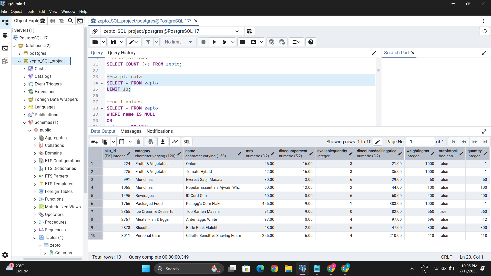
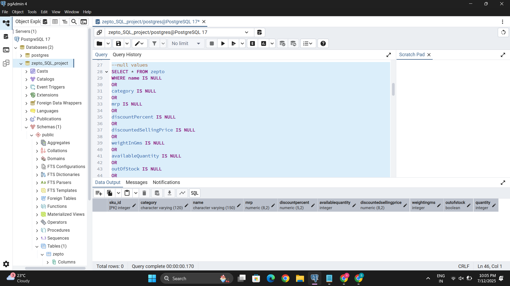
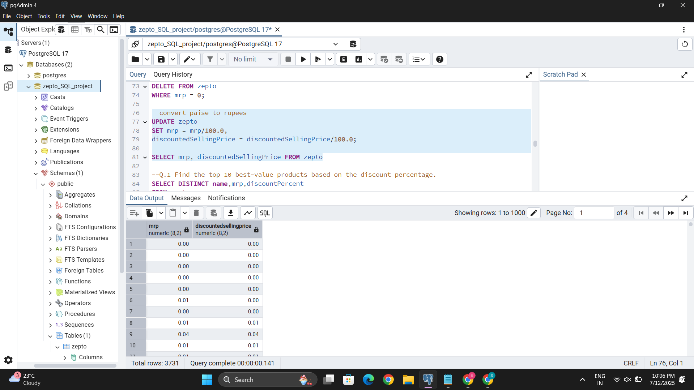
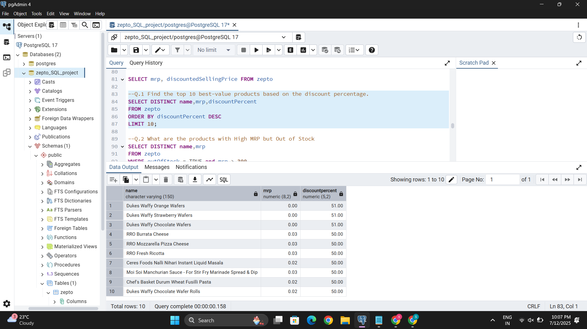
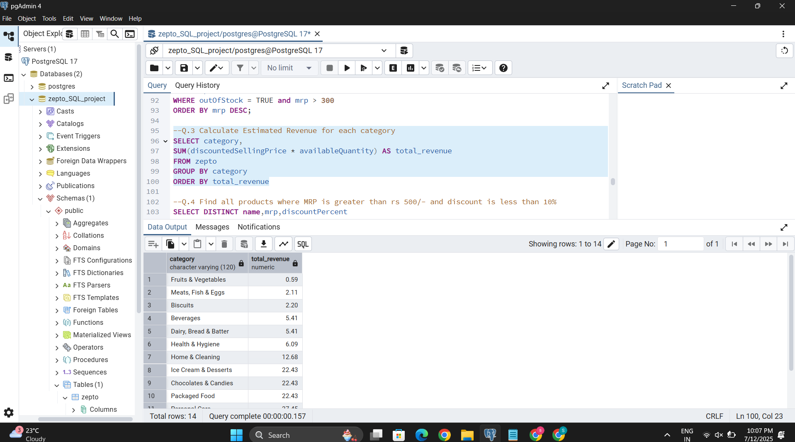
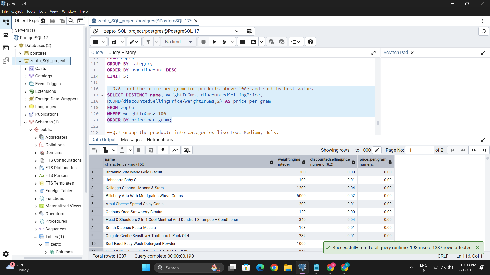
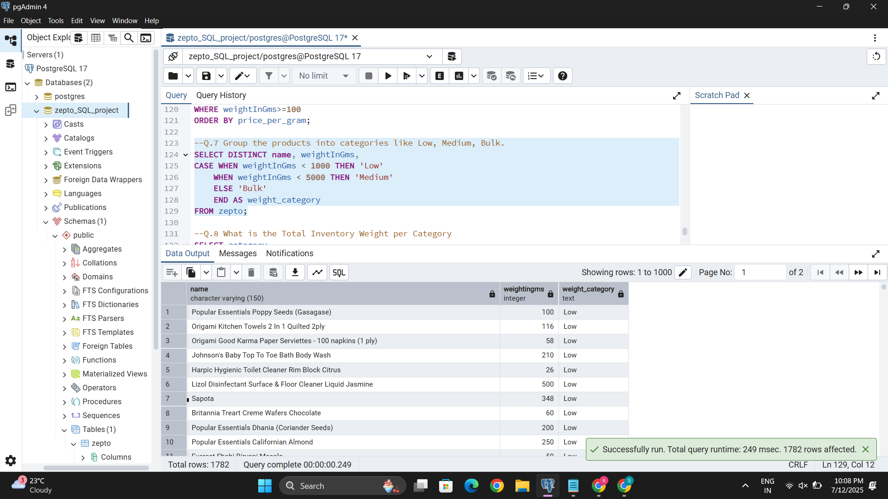

# 🛒 E-commerce Data Analysis using PostgreSQL – Zepto Inventory Project

This project is a complete SQL-based portfolio project that simulates real-world data analysis work on an e-commerce inventory dataset from **Zepto**, one of India’s fastest-growing quick-commerce startups.

The project demonstrates how a Data Analyst:
- Imports, explores, and cleans raw data
- Performs exploratory data analysis (EDA)
- Extracts business insights using **pure SQL**

---

## 📁 Project Structure

| File / Folder | Description |
|---------------|-------------|
| `zepto_schema.sql` | SQL script to create the `zepto` table schema |
| `zepto_analysis_queries.sql` | SQL queries used for EDA, cleaning, and business analysis |
| `zepto_v2.csv` | Sample raw dataset used for the project |
| `screenshots/` | Folder containing screenshots of outputs and analysis results |

---

## 🛠️ Tools Used

- PostgreSQL
- pgAdmin (or any SQL GUI)
- SQL (Pure)
- GitHub for version control

---

## 📊 Exploratory Data Analysis (EDA)

### 🔹 Initial Data Preview
  
*Displays the first 10 rows of the dataset after importing into PostgreSQL.*

### 🔹 Null Values Check
  
*Identifies records with missing values to be cleaned.*

---

## 🧹 Data Cleaning

### 🔹 MRP & Price Conversion
  
*Converts MRP and discounted selling prices from paise to rupees.*

---

## 📈 Business Insights

### 🔹 Top Discounted Products
  
*Highlights products offering the highest discount percentages.*

### 🔹 Revenue by Category
  
*Calculates estimated revenue based on available quantity and discounted selling price.*

### 🔹 Price per Gram Analysis
  
*Analyzes price per gram to identify best-value bulk products.*

### 🔹 Weight-Based Product Segmentation
  
*Classifies products into Low, Medium, and Bulk weight categories.*

---

## 📌 Key SQL Techniques Used

- `GROUP BY`, `ORDER BY`, `HAVING`
- Aggregate functions (`SUM`, `AVG`, `ROUND`)
- Data Cleaning using `UPDATE`, `DELETE`
- Filtering with `WHERE`, `DISTINCT`
- Conditional logic with `CASE`

---

## 📚 What I Learned

- Real-world database structuring and cleanup
- Data storytelling using only SQL
- How to answer business questions from messy datasets

---

## 🔗 Connect With Me

- 💼 [LinkedIn](https://www.linkedin.com/in/sejal-mahajan-a61b80256)
- 💻 [GitHub](https://github.com/sejalmahajan27)
